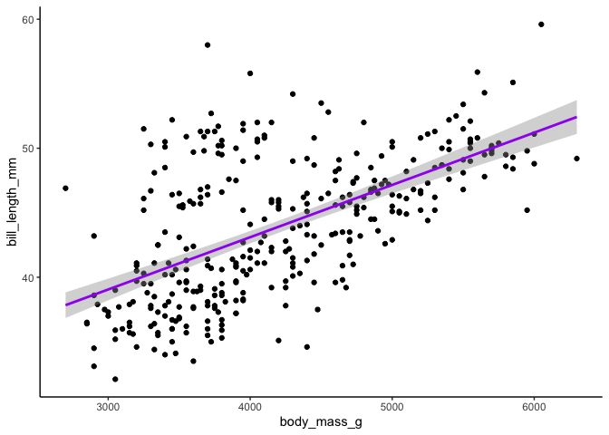

<!-- README.md is generated from README.Rmd. Please edit that file -->

# model2fit

<!-- badges: start -->

<!-- badges: end -->

The goal of model2fit is to …

## Installation

You can install the released version of model2fit from
[CRAN](https://CRAN.R-project.org) with:

``` r
devtools::install_github("trisango/model2fit")
```

## Example

This is a basic example which shows you how to solve a common problem:

``` r
library(model2fit)
scatter_lm('body_mass_g', 'bill_length_mm', palmerpenguins::penguins)
#> `geom_smooth()` using formula 'y ~ x'
```



What is special about using `README.Rmd` instead of just `README.md`?
You can include R chunks like so:

``` r
summary(cars)
#>      speed           dist       
#>  Min.   : 4.0   Min.   :  2.00  
#>  1st Qu.:12.0   1st Qu.: 26.00  
#>  Median :15.0   Median : 36.00  
#>  Mean   :15.4   Mean   : 42.98  
#>  3rd Qu.:19.0   3rd Qu.: 56.00  
#>  Max.   :25.0   Max.   :120.00
```

You’ll still need to render `README.Rmd` regularly, to keep `README.md`
up-to-date.

You can also embed plots, for example:


In that case, don’t forget to commit and push the resulting figure
files, so they display on GitHub\!
